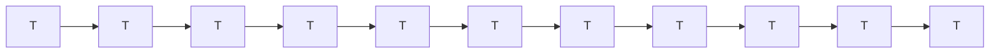
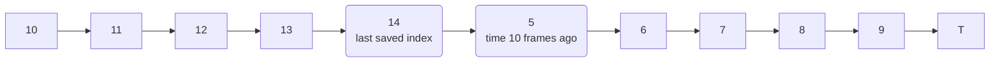
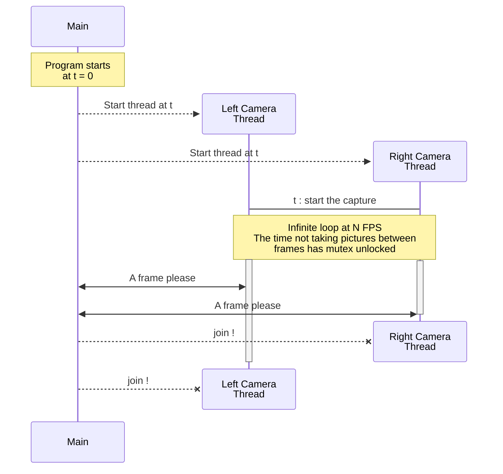

# Content to include in the project report

## Camera hardware

Set cameras brightness, disable auto-exposure ... (Using OpenCV, or else using bash scripts with v4l2-ctl)  
For the two cameras to properly work and be powered, be sure to use two USB port/buses.  
It might also work with a powered USB-hub, but your computer/USB port might also be a limitation.

### Intrinsic parameters of the Microsoft LifeCam HD-3000 webcam

We have to determine / find the $f_x$, $f_y$, $s$, $c_x$, and $c_y$ values.
Assuming $s = 0$

Microsoft gives the FOV in the diagonal direction only, and says the diagonal is at 68.5°

## Camera software

### How to measure the actual FPS of the capture ?

For a 1 second rolling-window average
For a camera running at a theoretical 10 fps (can't go faster), let's have an array of 1 * 10 + 1 items, initialized to the current time T :

We fill the array and loop on it `index = (index + 1) % 11`

The time it took to take 10 frames is : `time@last_saved_index - time@time_10_frames_ago`  
Which is `time@last_saved_index - time@(last_saved_index+1)%11`  
Therefore, what we save in them are timestamps, from `std::chrono::steady_clock`

This is a way to have a stabilized instantaneous FPS counter, that works on a fixed amount of memory.
In the case where the camera stops working, we know when was the last capture time : checking if this last time is long passed is enough to detect a sudden stop.

With this implementation, I can say 10fps aquisition with the 10fps cameras has been a success !    

## Stereo setup

In the stereo configuration, make sure the two images are taken at the same time.
When wired through a USB hub, use a hub with external power source, otherwise the cameras will fail at taking images simultaneously.
Even with tight cam->grab(), there still is a time difference between the two pictures (see video taken on Fab 14th)
So, let's use multithreading : 
    - Two threads = Two cameras
    - They capture continuously, starting from the same exact time std::this_thread::sleep_until

Notes on the implemented multithreading :

Giving both camera threads a time_point to start at, we get very good measures.
Using the std::chrono::high_definition_clock which prints system nanoseconds from epoch, we have : 

    - A time difference between two frames of the same scene (0 seconds expected) : 0.00989 seconds
    - A time difference between two consecutive frames by the same camera (1/fps = 0.1s expected) : 0.10002 seconds

---

When I capture the images (grabbing them from the camera / using cam.retrieve(frame)) every 500ms (slower than the camera fps) :

    - Time difference between the Left before and the Left after the capture (1/fps expected) : 0.10006 seconds
    - Time difference between the Right before and the Right after the capture (1/fps expected) : 0.10009 seconds

---

When I capture the images (grabbing them from the camera / using cam.retrieve(frame)) every 100ms (matching the camera fps) :

    - Time difference between the Left before and the Left after the capture (1/fps expected) : too long, the camera is strangled
    - Time difference between the Right before and the Right after the capture (1/fps expected) : too long, the camera is strangled

What happens here is that the takePicture is slowing down the takePicture internally, what we really don't want.
I want the camera to register images as fast as possible, and that takePicture would 

---

When I capture the images (grabbing them from the camera / using cam.retrieve(frame)) every 50ms (twice the camera fps) :

    - Time difference between the Left before and the Left after the capture (1/fps expected) :  seconds
    - Time difference between the Right before and the Right after the capture (1/fps expected) :  seconds

---

Playing both cameras looks like when the two cameras at playing on ffplay. It seems like 10fps (max from the camera with the greatest image definition).

If Camera::getPicture() is called more often than Camera::takePicture(), it seems to not cause a problem.
However, to protect from TOO MANY CALL, I limit the call to cam.retrieve with a bool newCapture, if a new picture was not taken : then just return the old one already saved without asking the camera for the old one again. But this needs an if, and CPU might have branch-misses. I don't know if this condition is really that needed, I keep it just in case. 

---

Is it possible to have a slip, so that a capture actually takes the 4th image taken from Left, and the 5th from Right ???????? !!!!!

## OS considerations

As the program need to interact with physical hardware (USB cameras), it might very easily brake when not using Linux/UNIX.

## OpenCV

## Open3D